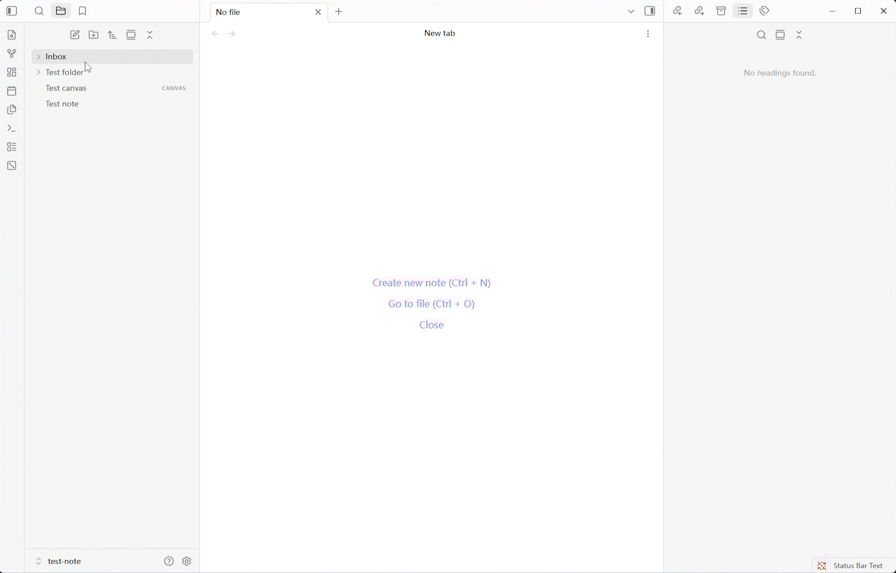

# Claude Artifact Extractor

A Tampermonkey userscript that exports Claude **research artifacts** to Markdown
**with every inline reference preserved** — and saves them straight into your
Obsidian vault.

Claude's built-in "Download as Markdown / PDF" drops the inline citations
entirely, and existing exporters typically keep none — or only the first
reference in each paragraph. This script captures the page's own API data and
rebuilds each artifact as clean Markdown with **all** of its references intact, as
footnotes.

## Features

- **Preserves every reference.** Unlike the native export and other exporters, no citation is lost.
- **Copy or Download** the artifact as Markdown.
- **Save to Obsidian.** Send an artifact directly into your vault as a new note, filed in the folder you choose.
- **Sensible note names.** Notes are named after the artifact's title as it appears in the chat.

## Usage

### Setting up Save to Obsidian

Before the **Save to Obsidian** button works, tell the script which vault to write
to. Open config menu through Tampermonkey or the ⚙ gear next to the **⬇ Artifacts** button, then:

1. Enter your **Obsidian vault name** (exactly as it appears in Obsidian).
2. Optionally set a **Folder path** for new notes — leave it blank to save at the
   vault root.
3. Click **Save**.

Obsidian must be installed and the named vault must exist. Notes are created
through Obsidian's `obsidian://new` URL scheme, so your browser may ask once for
permission to open Obsidian.

## Install

1. Install [Tampermonkey](https://www.tampermonkey.net/).
2. Install the script from **[Greasy Fork](https://greasyfork.org/en/scripts/580519-claude-artifact-extractor)**.
3. Open any conversation on Claude the floating **⬇ Artifacts** button appears in the corner.

## Privacy

The script runs entirely in your browser. It reads the artifact data Claude
already loaded into the page and writes only where you tell it (clipboard, a file,
or Obsidian). Nothing is ever sent out.

## Support this project

Claude-artifact-extractor is free for everyone and always will be. If you find this script helpful, you can star this project and buy me a coffee on ko-fi.

## Development

Building from source, architecture, and contributing notes live in
**[docs/DEVELOPMENT.md](docs/DEVELOPMENT.md)**.

## License

MIT
